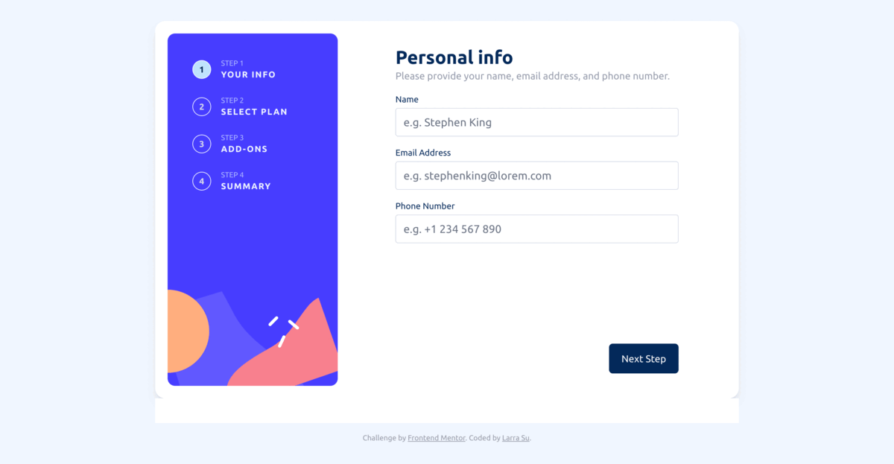
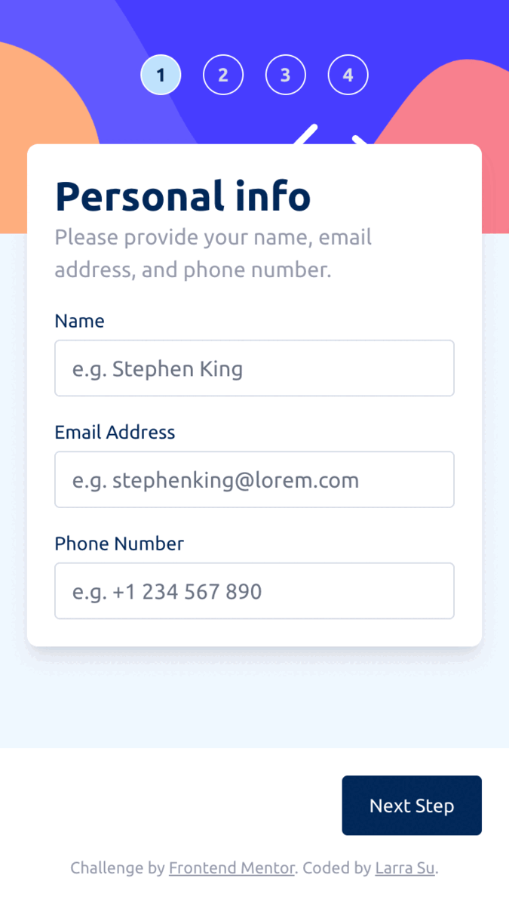

# Frontend Mentor - Multi-Step Form Solution

This is a solution to the [Multi-step form challenge on Frontend Mentor](https://www.frontendmentor.io/challenges/multistep-form-YVAnSdqQBJ). Frontend Mentor challenges help you improve your coding skills by building realistic projects.

## Table of contents

- [Frontend Mentor - Multi-Step Form Solution](#frontend-mentor---multi-step-form-solution)
  - [Table of contents](#table-of-contents)
  - [Overview](#overview)
    - [The challenge](#the-challenge)
    - [Screenshots](#screenshots)
    - [Links](#links)
  - [My process](#my-process)
    - [Built with](#built-with)
  - [Author](#author)

## Overview

### The challenge

Users should be able to:

- Complete each step of the sequence
- See a summary of their selections on the final step and confirm their order
- View the optimal layout for the interface depending on their device's screen size
- See hover and focus states for all interactive elements on the page

### Screenshots

### Links

- Solution URL: [Link](https://www.frontendmentor.io/solutions/multistep-form-using-nuxt-and-tailwind-css-oHtiyIwaZL)
- Live Site URL: [Link](https://fm-multi-step-form.vercel.app/)

## My process

### Built with

- [Nuxt](https://nuxt.com/) - Vue Framework
- [Tailwind CSS](https://tailwindcss.com) - CSS Framework
- [Headless UI](https://headlessui.dev) - Tailwind Component Library

## Author

- Website - [Larra Su](https://www.larrasu.com)
- Frontend Mentor - [@larrasu](https://www.frontendmentor.io/profile/larrasu)
